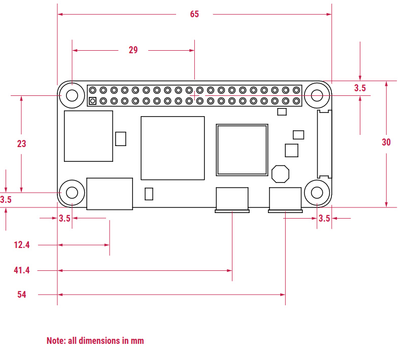

<!-- spellchecker:ignore datasheet elec insertable waveshare -->

# Physical Design Reference

All dimensions verified by direct measurement unless noted.

---

## Case Dimensions

| Parameter | Value | Derivation |
| -- | -- | -- |
| Width | **135mm** | 135mm clears 4mm nut towers (0.9mm walls) with 1.5mm margin right of display panel |
| Height | **210mm** | 2 + 170 (panel) + 35 (button area) + 2 = 209 → 210 |
| Front depth | 2mm | front bezel thickness |
| Back depth | 20mm | electronics stack 15.7mm + 2mm wall = 17.7mm min; 20mm gives 2.3mm clearance |
| Wall thickness | 2mm | nominal |

---

## Display (Waveshare 7.5" e-Paper V2, 800×480)

Datasheet:
[7.5inch\_e-Paper\_V2\_Specification.pdf](https://www.waveshare.com/w/upload/6/60/7.5inch_e-Paper_V2_Specification.pdf)

| Parameter | Value | Source |
| -- | -- | -- |
| Panel width | **111.2mm** ±0.2 | datasheet outline |
| Panel height | **170.2mm** ±0.2 | datasheet outline |
| Panel thickness | 1.18mm (modelled as 1.25mm) | datasheet; extra 0.07mm gives shelf clearance |
| Active screen width | **97.92mm** ±0.1 | datasheet AA |
| Active screen height | **163.2mm** ±0.1 | datasheet AA |
| Border — left / top / bottom | **3.5mm** (1.2 + 1.5 + 0.8) | datasheet PS/FPL/AA offsets |
| Border — right (wide) | **9.78mm** (= 111.2 − 3.5 − 97.92) | derived |

**Width centering:** active area centred in case (`_screen_x = (case_w −
screen_area_w) / 2 = 18.54mm`); panel left edge at `_disp_x = _screen_x −
display_border_narrow = 15.04mm`.

---

## Electronics Stack (Z-axis)

Portrait in case. Z=0 at pogo-pin underside (back plate face).

```text
Z = 0       pogo pin underside (PiSugar, back-plate side)
Z = 7.5mm   top of Pi Zero PCB
Z = 15.7mm  top of GPIO header pins  (≈ 16mm, used as elec_depth)
```

Breakdown: 7.5mm (pogo pins to Pi Zero PCB top) + 8.2mm (GPIO header incl.
plastic base).

**Waveshare HAT is NOT stacked** — placed side-by-side, hand-wired to GPIO pins.

---

## Component Measurements

### Battery

| Dimension | Value |
| -- | -- |
| Length | 59mm |
| Width | 28mm |
| Depth | 12.5mm (10.7mm body + 1.8mm magnet) |

Case orientation: **portrait** (28mm × 59mm footprint), right edge at X=65mm.

### Pi Zero 2W

 *Source: [Raspberry
Pi Zero 2 W Mechanical
Drawing](https://pip-assets.raspberrypi.com/categories/584-raspberry-pi-zero-2-w/documents/RP-008358-DS-1-raspberry-pi-zero-2-w-mechanical-drawing.pdf)
© Raspberry Pi Ltd*

Board: 65mm × 30mm, landscape. GPIO at top long edge.

**SD card** (left short edge):

| Parameter | Value |
| -- | -- |
| Top offset from GPIO edge | 5.5mm |
| Width (along edge) | 12mm |
| Length (into board) | 15.3mm total; 2.3mm protrudes beyond PCB |
| Height above PCB face | 1.25mm |

> **Design note:** SD card protrudes 2.3mm beyond the PCB left edge. Pi stack
> shifted 0.3mm right (`_elec_x = wall_t + 0.3`) so the card tip lands flush
> with the exterior face. The left wall still needs a slot cutout (12mm wide,
> ≥2mm deep) for card access.

**Bottom long edge connectors** (X = centre from left edge):

| Connector | X centre | Width | Length beyond PCB | Height |
| -- | -- | -- | -- | -- |
| mini HDMI | 12.4mm | 12mm | 8.5mm | 5mm |
| µUSB (power) | 41.4mm | — | — | — |
| µUSB (OTG) | 54mm | — | — | — |

### PiSugar 3

 *Source:
[PiSugar 3 product
page](https://docs.pisugar.com/docs/product-wiki/battery/pisugar3/pisugar-3-series)
© 2026 PiSugar Kitchen*

Same footprint as Pi Zero (65mm × 30mm). Mounted below Pi Zero; component face
points south (down) after 180° rotation around X axis.

**Bottom long edge** (south face, all X from left):

| Feature | X centre | Notes |
| -- | -- | -- |
| Power button (5) | 11.5mm | edge-mounted, faces down |
| Custom button (4) | 43.5mm | edge-mounted, faces down |
| USB-C input | 53.5mm (= 11.5mm from right) | edge-mounted, faces down |

**Button actuation:** flex tab printed into the south wall. Three 0.5mm slot
cuts (U-shape) free a 6mm × 4mm × 2mm tab. The hinge is a 2mm-wide (X) × 0.6mm
(Y) flexing beam, thinned on the interior face, starting at the fixed
wall/tab boundary and extending into the tab area (already freed top/bottom by
the slots) so it can flex along its full length. Hinge fold-line runs in the
case-depth (Z) direction = in-layer bending under print-Z-up orientation →
strong in PLA. Tab Z range: wall_t to wall_t+4mm (local Z=0–4), starting just
above the base plate and staying below the USB-C outer housing top (~6mm
local). No separate printed cap; no glue.

**Back relief:** the interior face of the tab (excluding the hinge) is thinned
by an additional 0.25mm, leaving 1.75mm thickness there, so the tab does not
press the PiSugar button at rest.

**Anti-droop print supports:** the bottom slot at the free end of each tab is
a complete cut (no built-in pillar). `hinge-print-supports.scad` defines
`hinge_print_supports()`: 4 standalone 0.5mm × 0.5mm × `btn_slot_kerf`-tall
towers (2 per tab) positioned inside the slot gap, placeable as separate
objects on the print bed to support the tab overhang. If not used, rely on
slicer-generated supports for that overhang instead.

**South wall outer pockets:** right µUSB (OTG, X=54) and USB-C (X=53.5) outer
pockets are merged into one combined cutout (X=47.25–59.95, Z=−0.5–12.25,
depth=2.5mm). Left µUSB outer pocket is individual (housing_w=11.9mm, right edge
X=47.35) — 0.1mm overlap with combined pocket eliminates coplanar render face;
left edge X=35.45 gives 5.95mm clearance from connector centre, matching the
combined pocket's 5.95mm clearance from right µUSB centre.

**PCB face** (south-facing, accessible from back plate):

| Feature | X | Y from bottom long edge | Notes |
| -- | -- | -- | -- |
| Reset button | 20.5mm | 5mm | label 6 in image; 1.5mm diameter through-hole in back plate |
| Power LED | 2mm | 19.0mm | 1×2mm window — through-hole (single filament) or transparent plug via `leds.scad` (multi-filament) |
| Indicator LEDs ×4 | 14.5–22.5mm (left edge to right edge) | 3mm | 8×2mm window — same approach as power LED |

### Waveshare HAT

| Dimension | Value |
| -- | -- |
| Length | 66mm |
| Width | 30mm |
| Height | 9.5mm |

Mounted near the display via two ⌀2.8mm holder pegs (66mm long edge along X,
30mm wide, holes 57.5mm apart and 4.25mm in from each end), hand-wired.

---

## Back-Cavity Layout (top view, X from left inner wall)

```text
x=0   x=37.3  x=67.3                    x=133
┌──────┬────────┬──────────────────────────┐
│      │battery │                          │
│      │ 28×59  │  (empty — HAT mounted    │
│      │portrait│   near display via pegs) │
│      │        │                          │
│      │        │                          │
├──────┴────────┤                          │
│ Pi Zero + PiSugar (65×30)                │
│ [←SD]  [HDMI][µUSB][µUSB]                │
│ [B5][▪▪▪▪][B4]           [USB-C]         │
└──────────────────────────────────────────┘
←──────65mm──────→
```

Key alignments:

- Battery right edge = Pi Zero right edge = X=65.3mm (0.3mm shift applied; short
  wire to PiSugar)
- HAT (30×66) mounted near display pillars via two ⌀2.8mm pegs; no longer in
  lower bay
- Right zone (X=67.3–133mm) empty at lower Y

---

## Assembly Hardware

### Side-entry screw towers (M2)

Four towers hang from the front plate inner face beside the left and right walls
(2 per side). Screws enter horizontally through the left/right case walls and
thread into captured hex nuts.

| Parameter | Value | Notes |
| -- | -- | -- |
| Tower depth (X) | 3.6mm | nut_t + 2mm walls (1mm each side) |
| Tower width (Y) | 15mm | clear of Pi stack at current screw Y positions |
| Tower height (Z from inner face) | 17mm | into back shell; leaves 1mm above back floor |
| Nut | M2 hex, 4mm AF, 1.6mm thick | side-loaded from outer Y face |
| Screw head diameter | 3.8mm | M2 button head; sinks in 2mm wall |
| Screw head height | 1.4mm | fully recessed in wall_t=2mm |
| Screw clearance depth | 25mm | from exterior; accommodates up to 25mm screws |
| Screw hole Z (from back exterior) | 11mm | centred in assembled depth (22mm) |
| Y positions | case_h/2 ± case_h×0.3 ≈ 42mm and 168mm | symmetric; clear of snap clips and Pi stack |

Nut trap: nut slides in from the outer Y face. Entry is tight (4.0mm in Z, no
tolerance) with a 4.2mm interior — 0.1mm step retains nut against gravity in any
orientation. A 2mm ejection hole on the inner Y wall allows pin removal.

---

### Mating-face rabbet/tongue joint

Back shell has a 1mm-wide × 1.5mm-deep rabbet cut into the inner face of all
four walls at the mating face. Front shell has a matching rectangular tongue
ring that protrudes below the mating face and fits into the rabbet.

| Parameter | Value | Notes |
| -- | -- | -- |
| Rabbet width | 1mm | into inner wall face; leaves 1mm of wall at joint |
| Rabbet depth | 1.5mm | from mating face — 2mm coincided with HDMI outer top at Z=18mm |
| Tongue width | 0.8mm (`rabbet_w - tol`) | |
| Tongue depth | 1.3mm (`rabbet_d - tol`) | 0.2mm clearance at bottom |
| Clearance per face | 0.1mm (`tol/2`) | |

Prevents visible gaps at the seam and self-aligns the two halves during
assembly. Corner geometry is rectangular (not filleted) — small visual gap at
the four corners is expected.

---

### USB-C charging notch (back shell, bottom edge)

| Parameter | Value |
| -- | -- |
| Notch width | 12mm |
| Notch height | 4mm |

Centred on the USB-C input (X=53.5mm in Pi stack coords → verify after final
layout).

### Magnet recesses (back plate inner face)

Two magnets glued into recesses on the back plate to retain the PiSugar and
battery.

| Parameter | Value | Notes |
| -- | -- | -- |
| Diameter | 15mm | derived from PiSugar board image; measure before printing |
| Recess depth | 1.5mm | leaves 0.5mm wall in 2mm back plate |

Positions (in back-plate internal coords, X/Y from left inner wall / bottom
inner wall):

| Magnet | X | Y |
| -- | -- | -- |
| PiSugar | elec_x + 20mm | elec_y + 15mm |
| Battery | bat_x + bat_w/2 (centred) | bat_y + bat_l − 18mm (from battery top) |

---

## Internal Compartment Walls

Short ribs on the back plate floor that locate and retain components. Heights
chosen to match component depth without over-constraining removal.

| Zone | Wall height |
| -- | -- |
| Battery bay walls | **12.5mm** (= bat_depth; fully contains battery) |
| Pi stack bay walls | 10mm |

A 5×5×1mm pad on the floor at the Pi stack's near corner (X=`wall_t`–`wall_t+5`,
Y=`wall_t`–`wall_t+5`) raises that corner by 1mm to prevent the stack from
tilting.

A 0.3mm-wide ridge along the inner west wall (X=`wall_t`–`_elec_x`,
Y=`_elec_y`–`_elec_y+elec_l`, Z up to 7.5mm — below the SD card slot) acts as a
stop for the Pi stack's left PCB edge, enforcing the `_elec_x = wall_t + 0.3`
offset so the SD card tip sits flush with the case exterior.

---

## Display Seating (back shell)

Four L-bracket holding blocks straddle the display panel edges; three
fully-recessed centre column pads provide mid-span support.

Display Z position: back face at Z=`back_depth − disp_thickness = 18.75mm`,
front face at Z=`back_depth = 20mm` (flush with mating face). The rabbet ring
only cuts the 1mm wall strip, so interior blocks are unaffected and the panel
can reach the mating face.

### Corner L-bracket blocks (×4)

Each block is 15×15mm in XY, full interior height (`back_depth - wall_t =
18mm`). A step cutout on the inner-facing half creates the panel shelf at
`back_depth − disp_thickness = 18.75mm`; the outer strip reaches `back_depth =
20mm`.

| Block | Position | Outer strip | Shelf Z |
| -- | -- | -- | -- |
| Left-top | centred on `_disp_x`, top corner | 7.5mm lateral stop | Z=18.75mm |
| Left-bottom | centred on `_disp_x`, 5mm below `_disp_y` | 7.5mm lateral stop; Y-face at `_disp_y` locks panel vertically | Z=18.75mm |
| Right-top | right face flush with inner wall | 5.5mm lateral stop (`case_w−wall_t − (_disp_x+display_w) = 133−127.5`) | Z=18.75mm |
| Right-bottom | right face flush with inner wall | 5.5mm lateral stop; Y-face at `_disp_y` locks panel vertically | Z=18.75mm |

Outer strip top at Z=20mm; shelf at Z=18.75mm; step height = 1.25mm =
`disp_thickness`. ✓

### Centre column pads (×3)

Fully recessed — top face at Z=18.75mm (display back face), no rim. 15×15mm
footprint, height `back_depth - wall_t - disp_thickness = 16.75mm`. Positioned
at mid-display Y, at left edge, centre, and right edge of display.

---

## Battery Retaining Lip

Single lip at the top end of the battery bay, spanning the full outer width
including compartment walls.

| Parameter | Value |
| -- | -- |
| Width (X) | `bat_w + 2 × wall_t = 32mm` |
| Depth (Y) | `10 + wall_t = 12mm` (from top battery wall inward) |
| Z bottom | `wall_t + bat_depth = 14.5mm` (sits on top of battery) |
| Z top | `back_depth − disp_thickness = 18.75mm` (doubles as display back-face support) |
| Height (Z) | `back_depth − wall_t − bat_depth − disp_thickness = 4.25mm` |

---

## Button Layout (bottom face, 4×2 grid)

Per ADR 0007: 8 buttons `btn_1`–`btn_8`. PiSugar 3 hardware button handles
power.

```text
[btn_1] [btn_2] [btn_3] [btn_4]   ← top row
[btn_5] [btn_6] [btn_7] [btn_8]   ← bottom row
```

GPIO mapping (BCM):

| Button | GPIO |
| -- | -- |
| btn_1 | 4 |
| btn_2 | 12 |
| btn_3 | 13 |
| btn_4 | 16 |
| btn_5 | 19 |
| btn_6 | 22 |
| btn_7 | 26 |
| btn_8 | 27 |

6×6mm tactile switches, 6mm total height (3mm base + 3mm stem), ~0.5mm travel.
Stem: 3.5×3.5mm square. 4-pin: left pair bridged, right pair bridged; press
connects left to right.

Button stack: printed cap (2mm total height, 1mm socket depth from top)
press-fit on stem. Cap top sits 1mm inside the front bezel (Z=21 from back
exterior), so stem tip is at Z=21, not Z=20 (front inner face). Carrier bottom
therefore at Z=14: stem_tip(21) − stem(3) − base(3) − floor(1). HDMI top at
Z=14.5 — 0.5mm clearance, no Y overlap so no conflict.

Button hole diameter: **10mm** (sized for the printed cap outer diameter; cap
fits with `tol` clearance).

Buttons mounted on an insertable carrier — see carrier design notes.

### Carrier support structures

The carrier rests at Z=14mm (back exterior origin) and is inserted vertically
from the mating face. Four support features retain it:

| Feature | Description | Top Z |
| -- | -- | -- |
| Left diagonal wedge | Ramp Z=11→14 at X=wall_t to X≈5.6mm, full Y span. Vertical retain blocks Z=14–18 at south (Y=2–6.5) and north (Y=28.5–33.5) of carrier | 18mm retain / 14mm ledge |
| Freestanding column 1 | wall_t-wide at X=`_elec_x+elec_w+12` (≈79mm, +2mm off the nominal 10mm-gap position to clear the carrier's wire-channel groove); same U-channel profile | 18mm retain / 14mm ledge |
| Freestanding column 2 | wall_t-wide at X=midpoint of col1's nominal position and right inner wall, minus 2mm (≈103mm, shifted to clear its wire-channel groove); same U-channel profile | 18mm retain / 14mm ledge |
| Right-wall ledge | 2.875mm-wide at the right inner wall (X=130–133mm; trimmed from 3mm to clear a 0.125mm overlap with the rightmost wire-channel groove); same U-channel profile | 18mm retain / 14mm ledge |

**U-channel profile:** each column has three Y sections:

- South retain (Y=2–6.5mm): full height Z=2–18, outside carrier footprint —
  blocks southward sliding once seated
- Ledge (Y=6.5–28.5mm): only Z=2–14, carrier rests here
- North retain (Y=28.5–33.5mm): full height Z=2–18, outside carrier footprint —
  blocks northward sliding

Carrier inserts vertically from mating face (Z=20→14). Retain walls (Z=14–18)
are outside the carrier Y span (6.5–28.5mm) so do not obstruct insertion. Once
seated, the retain walls rise above the carrier edges and lock it in Y.

Outer Y extent: south=`wall_t=2mm` (grounded into south inner wall),
north=`side_screw_y[0]−tower_w/2−1=33.5mm` (fused with nut tower receiver south
face, same as left diagonal wedge).

### Carrier front-plate contact rails

Five rails on the top face of the carrier close the 2mm gap to the front plate
inner face (carrier top Z=18mm, front plate inner face Z=20mm).

| Parameter | Value |
| -- | -- |
| Height | 2mm (carrier top Z=18mm → front plate Z=20mm) |
| Width (X) | 6mm each |
| Length (Y) | full carrier length (22mm) |
| X positions | left end (X=0), between each column pair (X=28.75, 62.5, 96.25mm), right end (X=125mm) |

Rails are clear of all button cap footprints (23.75mm between adjacent hole
edges; 9.875mm at each end).

### Carrier fit vs GPIO header (verified by geometry)

The carrier sits south of the GPIO pin header with comfortable clearance:

| Dimension | Value | Derivation |
| -- | -- | -- |
| GPIO header south face (case Y) | 30mm | `_elec_y + elec_l − 2 = 2 + 28` |
| Top button hole edge (case Y) | 29.5mm | `btn_row_y2 + btn_hole_diameter/2 = 24.5 + 5` |
| Switch body top edge (case Y) | 27.5mm | `btn_row_y2 + 3 = 24.5 + 3` |
| Y clearance (switch body → header) | **2.5mm** | ✓ fits |
| Carrier Z (from back exterior) | ~14mm | `back_depth − switch_h = 20 − 6` |
| GPIO header top Z (from back exterior) | 18mm | `wall_t + elec_depth = 2 + 16` |

The 0.5mm gap between the top hole edge (29.5mm) and the header (30mm) is tight
but irrelevant — the front-bezel hole is independent of the carrier. The carrier
only needs to clear the switch body top at Y=27.5mm, giving 2.5mm margin. In Z,
the carrier (Z≈14mm) sits below the header top (Z=18mm) and they do not share Y
space, so there is no volumetric conflict.

### Pi-stack lateral lock (insertable shim)

Wedges into the 12mm gap between the Pi stack's right PCB edge
(X=`_elec_x+elec_w`) and carrier support column 1 (X=`_elec_x+elec_w+12`),
locking the stack against X movement. Inserted vertically from the mating face,
full pillar height (`back_depth − wall_t`).

| Parameter | Value | Notes |
| -- | -- | -- |
| Thickness (X) | `12 − 0.5×tol = 11.9mm` | leaves 0.1mm clearance to column 1; oversized for trimming if print is slightly off |
| Y extent | `wall_t` to `_cni` (= `btn_row_y1 − 4 − 0.5×tol`) | south-retain zone of column 1, south of the carrier; avoids colliding with the carrier or the south-wall rabbet. Uses the same per-side tolerance as the carrier-seating cutaways (`_cni`/`_csi`) — the carrier's own Y tolerance can't be reused here due to cable guides |
| Guide wedge | flat face at Y=`_cni`, ramps Z=`wall_t`→`wall_t+3` over 1.5mm (north of the shim) | back-shell floor feature, same hull pattern as the divider's south/north guide wedges — retains the shim's north edge |

---

## Deliberate Omissions

### Ventilation holes

No ventilation holes in the back shell. Pi Zero 2W in an e-ink application is
thermally trivial (~1W idle, infrequent display updates) and runs without
throttling in sealed enclosures. PiSugar handles battery thermal protection in
firmware. Holes would add dust ingress and geometry complexity for no practical
benefit at this thermal load. Revisit only if sustained-load use cases emerge.

### Snap-fit clips

Dropped in favour of the rabbet/tongue joint (alignment) + M2 side screws
(retention). Those two mechanisms are complete; snaps would be a third redundant
retention layer. The snap receiver pockets also conflict geometrically with the
rabbet cut at the mating face. Tool-free opening was the only potential benefit
but is outweighed by the added complexity.
